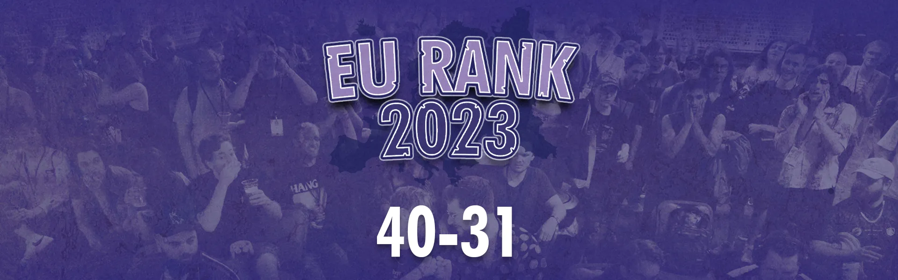

EURank 2023 continues with ranks 40–31, featuring players from seven different countries and multiple first appereances on European rankings. Let us celebrate these competitors and congratulate them on their performances throughout 2023.

**Previous Articles:**

[EURank 2023 Announcement](https://medium.com/eurank2023/eurank-2023-b1ecb083e024)

[Honourable Mentions](https://medium.com/@Nicki_Melee/eurank-2023-the-honourable-mentions-a183d3888b95)

[50–41](https://medium.com/@Nicki_Melee/eurank-2023-50-41-b54e8a6c5a59)

**#40:**  Lil Chief |  **Score:**  40.71

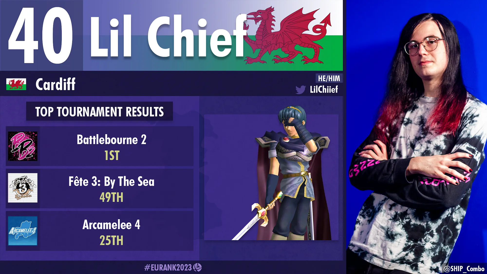

This year, the most talked about man in UK  _Melee_  has let his actions talk back. From being the head TO of perhaps the most active scene in the UK, to beating Frenzy at a tournament he was hosting, there’s no argument that this UK Marth is on an upwards trend. The Chief rounded out an exciting year with the biggest tournament of his career at  _Battlebourne 2_, beating Squeachu, Pi, Laurster and GG — ripping a well deserved and characteristic pop off at the final victory. With a laundry list of wins on a balance of both floaties and fast fallers, it seems like this Marth isn’t just a spacie slayer anymore, and will be a serious threat to anyone who crosses his path.

As the Cardiff scene continues to grow in 2024, you can expect to see more wins and to hear more about Lil Chief in the coming year.

_- GG_

**#39:**  saftblandarN |  **Score:**  40.46

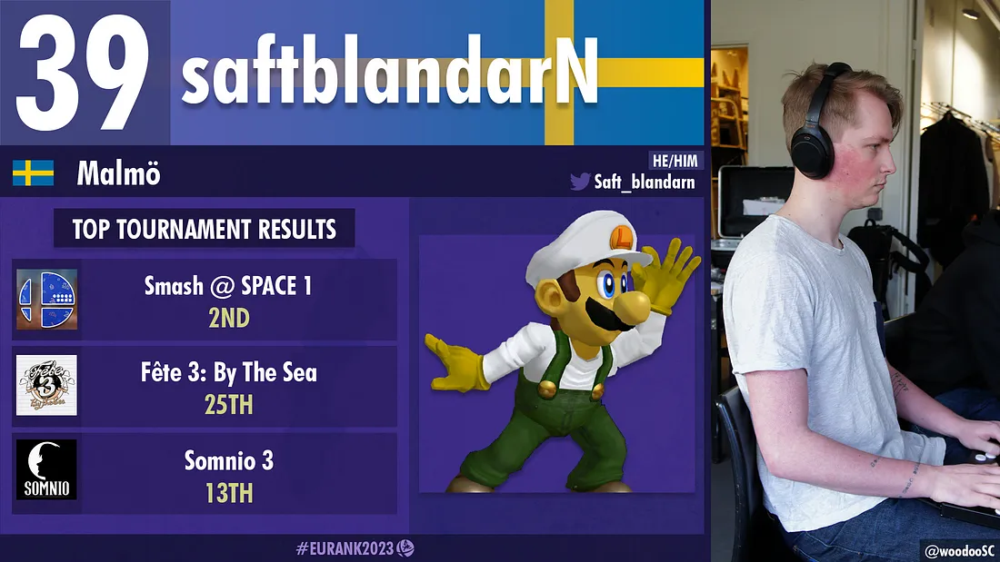

In a landscape predominantly dictated by conforming to optimal characters and formulaically emulating top players, saftblandarN’s  Luigi is a breath of fresh air that reminds us of the game’s immense depth and limitless potential.

The Swedish scene has always been prone to echo the footsteps of their established giants, but saftblandarN challenged that status quo in 2023, being the first wielder of a mid-tier to crack into the top 4 on Sweden’s prestigious power rankings since Daydee in 2017, and leaping eight placements on the ranking — the most of anyone in the country. If you want to personally experience the Luigi that looms in the nightmares of Sweden’s greatest players, check out his  [latest combo video](https://www.youtube.com/watch?v=rxd_RWxX8S0)  where he makes a serious claim at being the most technical Luigi in Europe.

With all that in mind, It should be no surprise that Saftblandarn has been on an unparalleled grind, exemplified perfectly by him meeting the activity requirements to be ranked on Stockholm’s local PR… Despite living 6 hours away.  
When home in Malmö he inexplicably also finds the time to TO cornerstone events like Kappa Clash and SMiSK, where you can experience being beat up by 3–4 hidden bosses, a platform-warping Luigi and perhaps even a sneaky ape in a tie.

Ultimately saftblandarN’s rise to prominence is not just a testament to his skill but a celebration of the unconventional, proving that in the ever-evolving world of Super Smash Bros. Melee, forging one’s own path can lead to extraordinary success.

_- “Thore” Emil Blaksmark_

**#38:**  Pi |  **Score:**  39.88

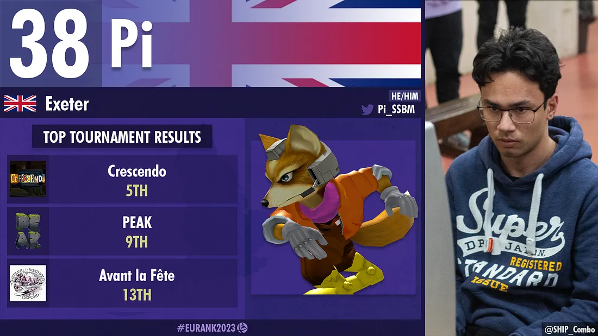

There’s a kind of mental bias we have towards players that flourish and bloom rather than players that are increscent. Our natural affinity for underdogs means that the expectation of a win makes the win less impressive. Which is probably why hard workers like Pi are so often overlooked.

Pi is a bluechip, he’s a safe bet. He keeps his head down, focuses on his own improvement and doesn’t talk about himself. Raised from the premium stock of Bristol spacies, he has spent the last year flagging a little behind his peers (Frenzy, Kingu, Luke), which is maybe an unavoidable aftereffect of being part of such a strong scene. But over the last few months we’ve seen Pi’s results gradually become more and more impressive, placing him in neck and neck contention with the other Foxes he’s often compared to. Sets that were a toss up a year ago have since become easy wins and where things would have been unwinnable there are now close matches.

When you’re watching Pi a year from now, just remember this is just the protraction of a trend, nothing you’ll be seeing is outside of the model we have today.

_- Liquid Jeans_

**#37:**  Tony Bomboni | **Score:**  38.11

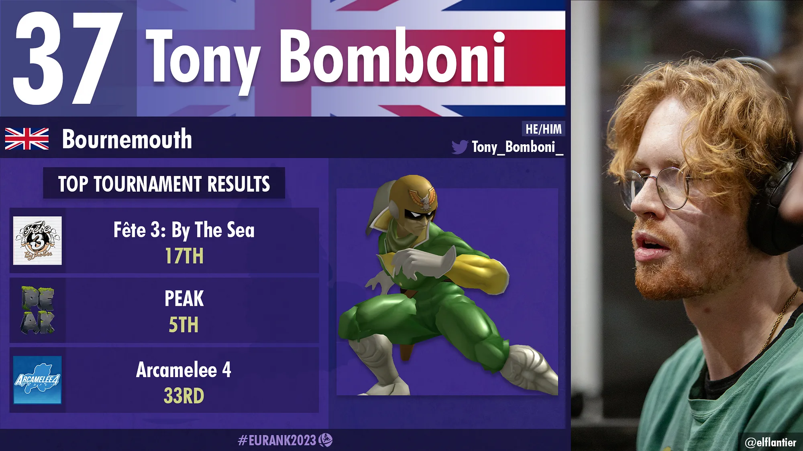

As exciting to play as to be around; Tony Bomboni, despite being the kind of person to have a gold star system at home to encourage and remind him to do his chores, remains a threat in any bracket. Having domestic success for a while, Tony has attended more international events as of late and ended the hopes of many of his opponents. With a good matchup spread, the speed, the reads and the combo routes that make you question reality, Tony Bomboni will continue to be not only a fan favourite but a run killer for a while to come.

_- BiGMaks_

**#36:**  irfan |  **Score:**  35.32

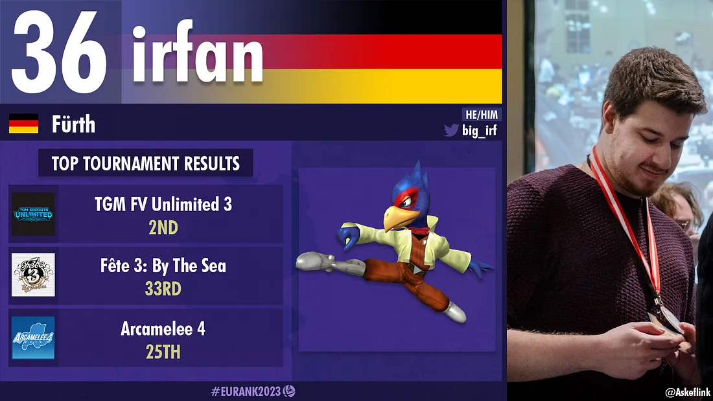

_“Oh no, I have to play irfan next!”_  What top EU players knew for a long time and everyone on unranked understands is finally starting to become internationally recognized: Damn, this Falco is insanely good.

His “big brain” playstyle, knowledge of every Falco move and laser height imaginable and his perfect usage of offensive and defensive mixups while adapting to his opponents with high speed make irfan an incredible hard opponent, who is almost unbeatable except by  _“masheeeers”_  and  _“taaapjuuump”_.

The grinder’s singles performances secured him the #6 spot on the German PR, beating international talent in 10QuidShoes, Jim Morrison and Acke. His results are even better in Germany, holding a 2–1 record against Parsecco and an insane 4–0 record against fellow German Falco King, never placing worse than 5th at every German tournament he attended this year.

You cannot avoid talking about his doubles gameplay, as irfan won multiple German national doubles events with different teammates, beating one of the very best european teams in Kins0/Rikzz multiple times in the process. Since the falco player is (finally) on a hiatus of TOing multiple nationals a year, we can only hope to see irfan use this time, not succumb to League of Legends, and attend more tournaments because oh boy, we definitely have not seen his final form yet.

_- astar_

**#35:**  Raptori |  **Score:**  34.66

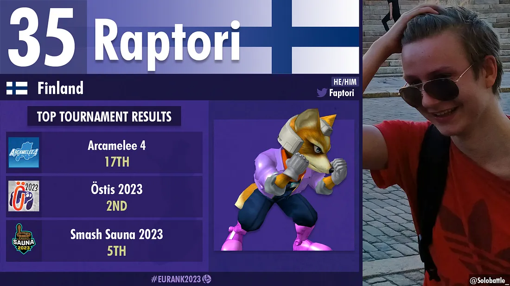

Raptori is a technical, dash dance heavy Fox main with clean ledge dashes, who excels at the Jigglypuff matchup. He jumped into Melee in 2018, starting with netplay tournaments and an Xbox controller. He joined his first IRL tournament in Finland later in 2018 and bought his first GameCube controller there. Since then, Raptori has secured multiple PR spots in Finland, the most recent one being #2. Raptori went to his first out-of-country tournament,  _Arcamelee #4_, in 2023 where he placed 17th. Last year, he took down players like raoul, Velani, and noon. Raptori is the only Finnish player capable of taking a set against Solobattle, who’s been one of his closest friends and training partners in the scene.

Raptori’s an active player, hitting up both the big tournaments and the chill local gatherings. He’s down to play with anyone, no matter their skill level, and he’s always up for giving pointers to help others step up their game. Raptori is a grounded person who just seems to love playing Melee. Moving forward, you can probably find him continuing to do what he has always been doing: Grinding netplay, entering tournaments and outperforming his seed.

_- Acke & Jekku_

**#34:**  noon |  **Score:**  34.43

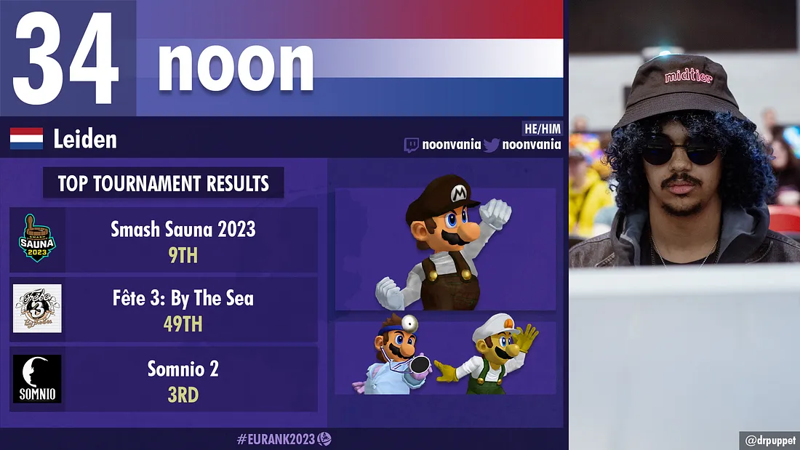

noon is perhaps one of the most interesting players to emerge from the Dutch post-pandemic generation. The long-time Smashladder grinder managed to hit the ground running as the Netherlands’ unlikely second high-level plumber main. He has since supplemented his primary character Mario with a Dr. Mario  **and** Luigi secondary, truly one of the more on-brand moves for a player from the country with 15 unique characters on its PR.

Departing from talking about wacky character choices, noon has shown he’s serious about competing and has proven as much with his run at  _Somnio #2_, where his run began with a trio of matchups you only see in the Netherlands with Risc, NVZ, and Madness (DK, Yoshi, and Luigi). Afterwards, a sense of normalcy overtook the venue when he faced - and defeated — the Netherlands’ two top Fox mains Happymealz and $TYN, eventually bowing out to Mahie and Skullbro. His 3rd place finish combined with his consistent performance at other domestic events draws the picture of somebody serious about taking the plumbers to new heights.

_- nago_

**#33:**  chaos6 |  **Score:**  33.63

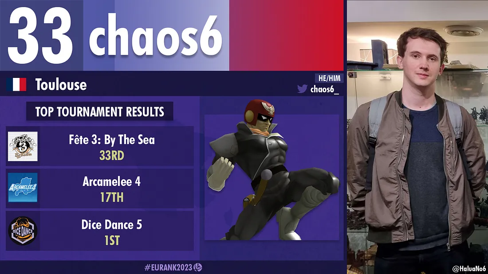

French Captain Falcon main chaos6 had a somewhat quiet 2023, only attending a total of eight events. Despite this, only once did he place below his seed. Residing in Toulouse, chaos6 found himself sitting in grand finals each time he would attend the city’s local,  _Dice Dance_. Out of his six local appearances, he would place first and second three times each, only losing to two separate players. With the opportunity to attend 2023’s European major,  _Fête 3: By the Sea_, chaos6 showed up big time with an upset over Nuckels in pools and an additional upset over noon in bracket, with respectable losses to Trif and Okameed for an outstanding 33rd place finish. Even more impressive was his run just shy of top 16 at  _Arcamelee #4_, where he beat Tony Bomboni, Rikzz, and skullbro, losing to Jadde in a close last-game set. chaos6’s balance of consistency and reaching new heights paves the way for an even more exciting 2024.

_- MNR_

**#32:**  King |  **Score:**  33.00

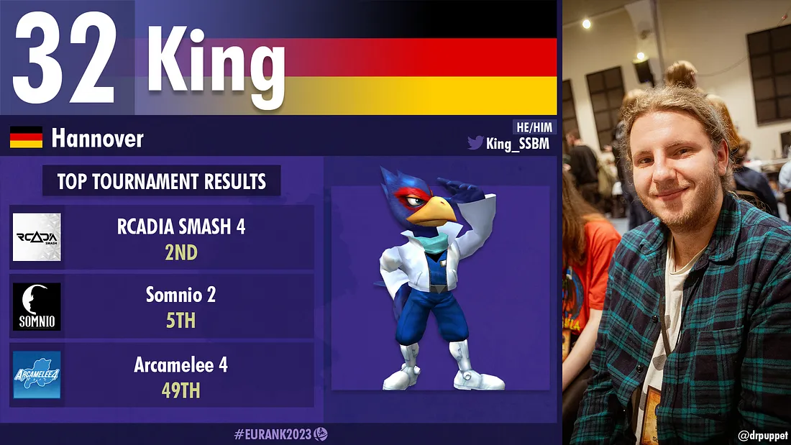

The Hannover native King is the proud owner of the largest collection of CRTs and tournament-ready Wiis in the entirety of the German Melee community. Not only that, King also has a minibus that he loads up with setups and uses to drive around not only Germany but all of Europe in order to help out tournament organizers everywhere, delivering tens of setups at a time. Now you might be thinking that this guardian angel can’t possibly be a sick competitor, too, right? You are sadly mistaken, because this blue Falco who can switch between his trusty rectangle and his old controller on a whim with seemingly no drawbacks has racked up wins over $TYN, astar, NekoKaze, Noxxa and Blaze. We can only hope King continues to provide tournaments with setups only to then tear through their brackets for many years to come.

_- yung Ullrich_

**#31:**  Velani |  **Score:**  32.32

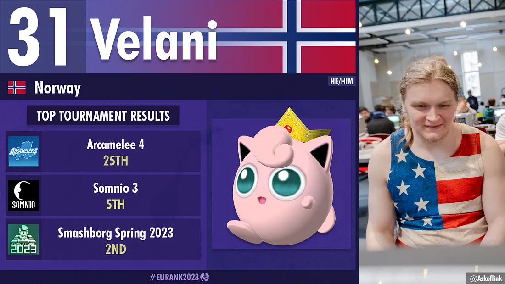

One of the biggest revelations for EU Melee in 2022 was the rapid ascension of a Swedish Marth main from a small town in rural Sweden who went by the name of Abbe. In 2023, we are moving away from central Sweden to Troms county, northern Norway, all the way in the Arctic Circle, and meeting a Puff player named Velani. In contrast to Abbe, Velani actually attended in-person events prior to the pandemic, but he slowly started breaking out during the online era and managed to establish himself as one of the stronger players in Scandinavia.

With him living in such a relatively isolated region, Velani has to travel far to get his sets in against the best of the continent. He has managed to make the most of his limited opportunities, namely  _Somnio 3_  and  _Arcamelee #4_, where he picked up a varied list of wins including Aaron, chaos6, and Madness. These performances along with his strong domestic results, also secured him a 2nd place spot during the last Norwegian ranking season.

_- nago_

That concludes ranks 40–31. Tomorrow we’re entering the top half of this ranking, and we’re excited to show you who made it.

**The EURank Team**

_Dominik “Nicki” Kunze — Director_

_Wout “Noxxa” van Poppel — Assistant Director & Data Lead_

_Nago — Assistant Director & Data Collection_

_EuO — Data Collection_

_Ambisinister — Data Processing_

_zondy — chill viber_

_Filip “Flippy” Tengwall — Graphics Lead_

_Brendan “GimmeDatWheat” Malone — Consultation_